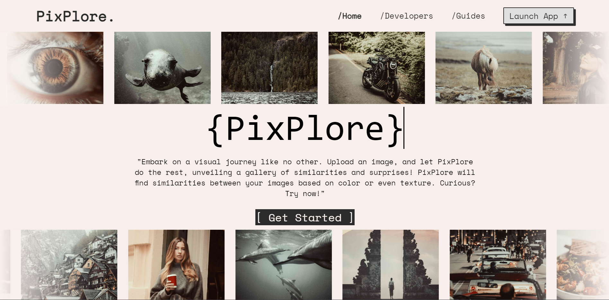
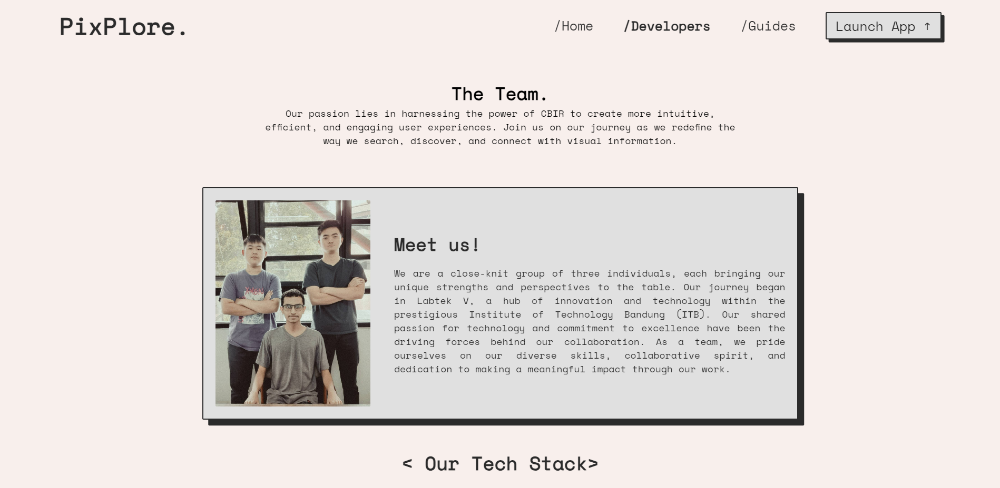
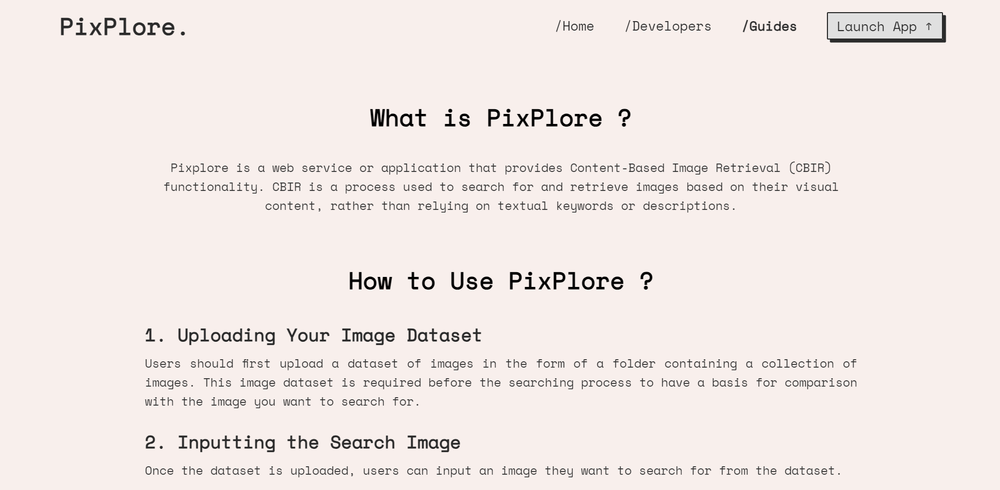
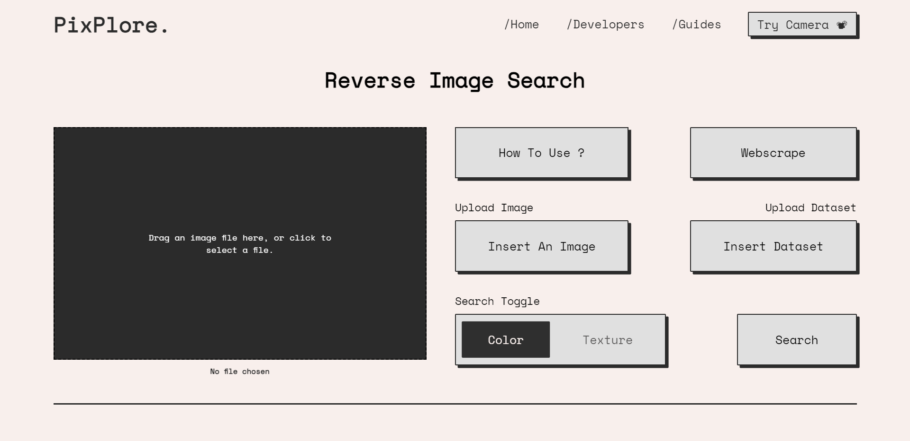
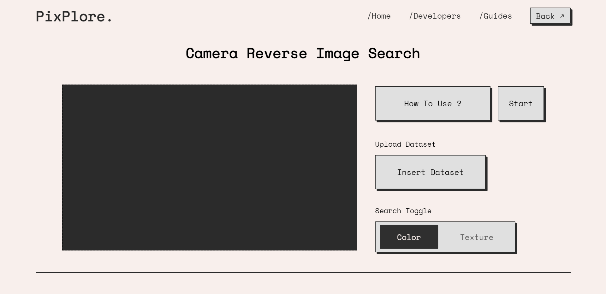

# Tugas Besar 2 IF2123 Aljabar Linier dan Geometri
> Pixplore – Content Based Image Retrieval System, a project for the Linear Algebra and Geometry Class at ITB.


## Table of Contents
* [General Info](#general-information)
* [Technologies Used](#technologies-used)
* [Features](#features)
* [Screenshots](#screenshots)
* [Setup](#setup)
* [Usage](#usage)
* [Project Status](#project-status)
* [Room for Improvement](#room-for-improvement)
* [Acknowledgements](#acknowledgements)
* [Contact](#contact)
* [Additional Notes](#additional-notes)


## General Information
Pixplore is an innovative Content Based Image Retrieval (CBIR) system developed as a project for the Linear Algebra and Geometry Class at ITB. Leveraging the principles of linear algebra, Pixplore offers an intuitive and efficient way to search and retrieve images based on visual content such as color and texture. This system is particularly useful in fields where visual content is paramount, like digital libraries, medical imaging, and digital forensics.


## Technologies Used
- Flask - 3.0.0 
- HTMX - 1.9.8 
- Python - 3.11.2


## Features
Pixplore is equipped with several advanced features, including:
- Color-based CBIR: Allows users to search for images based on color distribution.
- Texture-based CBIR: Facilitates image search based on texture patterns.
- Webscraping for dataset: Automated collection of images from the web to build a diverse dataset.
- Camera integration for input images: Users can input images directly using their camera.
- Report generation: Enables users to generate comprehensive reports of their search results.


## Screenshots







## Setup
To set up Pixplore, follow these steps:
1. Clone the repository
```
git clone https://github.com/Filbert88/Algeo02-22021.git
```
2. Navigate to the project source code directory
```
cd Algeo02-22021/src
```
3. Set up a virtual environment (optional but recommended)
```
python -m venv env
```
4. Activate the virtual environment
- For Windows
```
env\Scripts\activate
```
- For MacOS and Linux
```
source env/bin/activate
```
5. Install dependencies in requirements.txt
```
pip install -r requirements.txt
```


## Usage
To use Pixplore:
1. Ensure setup is complete and the [prerequisites](#prerequisites) installed.
- Follow all the [setup](#setup) steps and have the necessary dependencies installed.
2. Run the application
- Navigate to the `src` directory
  ```
  cd src
  ```
- Start the application
  ```
  flask run --debug
  ```
3. Accessing the Application
- Open a web browser and go to `http://localhost:5000`.


## Project Status
Project is currently complete and fully functional, but isn't live/deployed.


## Room for Improvement
Future enhancements could include:

- Development of a faster algorithm for converting RGB to HSV.
- Improved algorithms for calculating similarity metrics.
- Enhanced efficiency in calculating histogram vectors for color CBIR.


## Acknowledgements
- This project was inspired by the Linear Algebra and Geometry Class at ITB, 2023.
- Special thanks to our mentors and peers who provided invaluable feedback.


## Contact
Pixplore was created by:

1. Filbert / 13522021 [GitHub Profile](https://github.com/Filbert88)
2. Juan Alfred Wijaya / 13522073 [GitHub Profile](https://github.com/juanaw6)
3. Azmi Mahmud Bazeid / 13522109 [GitHub Profile](https://github.com/RealAzzmi)

For further inquiries or contributions, please contact us.

## Additional Notes

#### Prerequisites
- **Python Installation**: This application requires Python to be installed on your system. If you do not have Python installed, download and install the latest version from [python.org](https://www.python.org/downloads/). We recommend using Python 3.11 or higher.

#### Intended Environment
- **Development or Testing**: This application is currently in the development or testing phase. It is not recommended for production use at this stage.

#### Troubleshooting
- If you encounter any issues during setup or usage, please first ensure that all steps in the 'Setup' section have been followed correctly.
- Ensure that the Python version used is compatible with the application requirements.
- If using a virtual environment, verify that it is activated before running the application.
- For any dependency-related issues, try re-installing the dependencies using `pip install -r requirements.txt`.

#### Feedback and Contributions
- We welcome feedback and contributions to this project. If you have suggestions or encounter any issues, please feel free to reach out or open an issue on the
